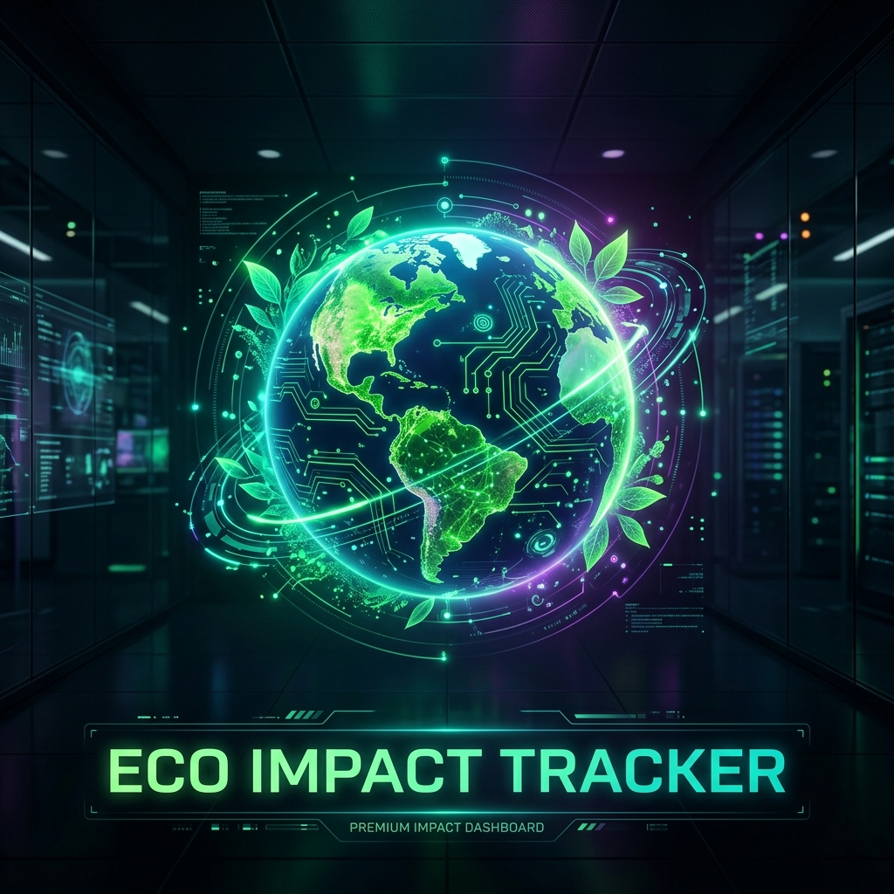
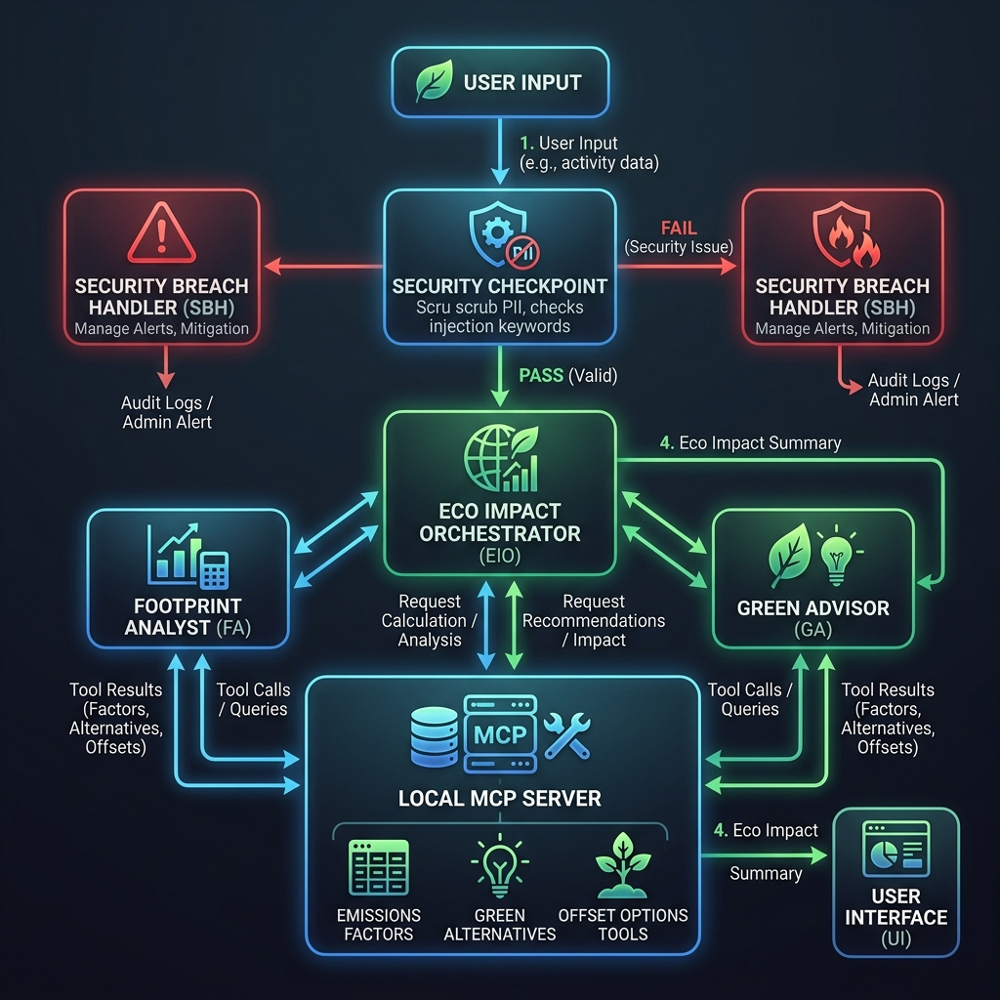

# 🌿 EcoImpact Tracker



An intelligent, multi-agent sustainability platform built with the **Google ADK 2.0 Workflow API** and **Model Context Protocol (MCP)**. EcoImpact Tracker allows users to input their consumption logs, automatically audit them for security violations, calculate their carbon footprint using live local MCP tools, and get localized green alternatives and offset strategies.

---

## 📐 System Architecture

Below is the high-level architecture diagram detailing the security check routing, multi-agent orchestration, and MCP server integrations:



1. **User Input / Logs**: Handled via the local REST/SSE endpoint or web dashboard.
2. **Security Checkpoint Node**: Scubs PII data (regex matching for email/phone numbers), validates prompt injection keywords, logs structured JSON audit checks to stdout, and blocks numerical spams or massive payloads.
3. **Orchestrator Node**: Manages state-sharing and delegates calculations and advisory tasks to child agents. Pauses with `request_input` to ask for human approval.
4. **Footprint Analyst**: Calls MCP tools to calculate carbon emissions from logs.
5. **Green Advisor**: Queries MCP tools for local alternative swaps and tree-offset estimations.
6. **MCP Server**: Stdio-based server exposing domain lookup tools.

---

## ✨ Key Features

- **Multi-Agent Orchestration**: Powered by a Python ADK 2.0 graph workflow utilizing an Orchestrator, Analyst, and Advisor.
- **Model Context Protocol (MCP)**: Custom stdio-based MCP server providing carbon footprint calculations and green database queries.
- **Security Checkpoint Node**: Proactive protection against prompt injection, data leaks, and numerical spams.
- **Interactive Web Interface**: Beautiful, responsive, dark-mode dashboard (with real-time sliders and dynamic charts) that connects to the live agent SSE API or operates in simulation mode.
- **Human-in-the-Loop (HITL)**: Action plans require explicit approval before finalizing logs.

---

## 🚀 Quick Start

### 1. Requirements
Ensure you have Python 3.11+, `uv` installed, and a Gemini API Key.

Save your key in a `.env` file in the project folder:
```env
GOOGLE_API_KEY=your_gemini_api_key_here
GEMINI_MODEL=gemini-2.5-flash
```

### 2. Installation
Install all dependencies (including FastAPI, Uvicorn, and MCP SDK) using `uv`:
```bash
uv sync
```

### 3. Running the Agent Backend (Playground)
Launch the ADK web server to start the agents:
```bash
make playground
```
This runs the playground server on port `18081`.

### 4. Running the Interactive UI
Open a new terminal and run:
```bash
make frontend
```
Navigate to **[http://localhost:3000](http://localhost:3000)** to interact with your dashboard!

---

## 🧪 Demo / Sample Test Case

Paste the following payload into either the web dashboard or playground:

```text
Here is my consumption log for last month:
- Contact Email: test.user@gmail.com
- Travel: I took a flight of 3400 miles.
- Diet: I consumed 5 kg of meat and 10 kg of vegetables.
- Home Energy: Used 250 kWh of grid electricity.
```

### Expected Output Behavior:
1. **PII Redacted**: `test.user@gmail.com` is replaced by `[EMAIL_REDACTED]`.
2. **Audit Logging**: A structured JSON warning/info log is outputted to the server console.
3. **Emissions Factor MCP Lookup**: The analyst queries `calculate_emissions_factor` for grid electricity (0.38 kg CO2/kWh), domestic flights (0.25 kg CO2/mile), and meat diet (27 kg CO2/kg).
4. **Calculations**: Outputs a breakdown totaling `1095.0 kg CO2`.
5. **Alternative Advice**: The advisor suggests green swaps (smart thermostats, heat pumps, VCS offsets, and planting ~50 trees).
6. **HITL Interruption**: The workflow pauses, prompting: *"Do you approve this sustainability action plan or have any updates?"*

---

## 🌍 Impact & Value Statement

**Who benefits and how:**
- **Individuals**: Gain clear, quantified visibility into their daily footprint with actionable steps (such as heat pump conversions and plant-based dietary shifts) to lower emissions.
- **Sustainability Consultants**: Can leverage the extensible MCP toolset to connect with corporate carbon offset APIs, automate auditing, and generate verified reports.
- **The Environment**: Every actionable swap reduces carbon emissions, directing support to verified VCS renewable energy projects and reforestation.

---

## 🔗 Push to GitHub

1. Create a new repo at https://github.com/new
   - Name: `ECO-IMPACT-TRACKER`
   - Visibility: Public or Private
   - Do NOT initialize with README (you already have one)

2. In your terminal, navigate into your project folder and run:
   ```bash
   cd eco-impact-tracker
   git init
   git add .
   git commit -m "Initial commit: eco-impact-tracker ADK agent"
   git branch -M main
   git remote add origin https://github.com/YOUR-USERNAME/ECO-IMPACT-TRACKER.git
   git push -u origin main
   ```

3. Verify `.gitignore` includes:
   ```gitignore
   .adk/
   .env
   .venv/
   __pycache__/
   ```
